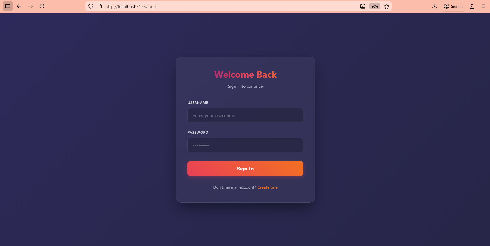
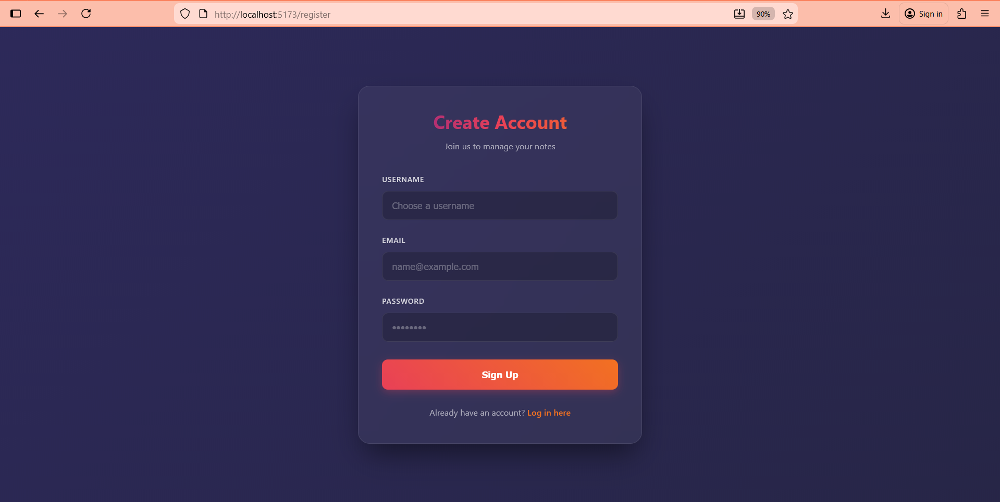
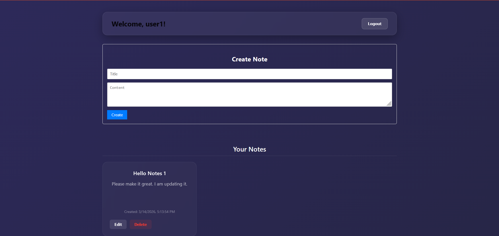

#  NoteVault — Scalable Notes CRUD Application

> **Backend Developer Intern Assessment** — Full-stack production-ready REST API with Authentication, Role-Based Access, and a modern React frontend.

---

##  Overview

**NoteVault** is a full-stack application built to demonstrate secure, scalable API architecture. It includes a FastAPI backend with JWT authentication and a React.js frontend with a premium dark-theme UI.

---

## Screenshots

### Login Page


### Register Page


### Dashboard (Notes CRUD)



## 🏗️ Project Structure

```
PrimeTrade.ai/
├── backend/          # FastAPI REST API (Python)
│   ├── app/
│   │   ├── core/         # Config, JWT & Security
│   │   ├── database/     # MongoDB Motor client
│   │   ├── models/       # DB models
│   │   ├── schemas/      # Pydantic validators
│   │   ├── services/     # Business logic
│   │   ├── routes/       # API route handlers
│   │   ├── utils/        # Dependencies (auth guards)
│   │   └── main.py       # Application entry point
│   ├── .env
│   └── requirements.txt
│
├── frontend/         # React.js (Vite)
│   ├── src/
│   │   ├── api/          # Axios client with JWT interceptor
│   │   ├── components/   # Reusable components (NoteForm, ProtectedRoute)
│   │   ├── context/      # AuthContext (global auth state)
│   │   └── pages/        # Login, Register, Dashboard
│   ├── .env
│   └── package.json
│
└── README.md         # ← You are here
```

---

##  Features Implemented

### Backend
-  **JWT Authentication** — Access + Refresh token flow
-  **Password Hashing** — using `bcrypt`
-  **Role-Based Access Control** — `user` vs `admin` roles
-  **Notes CRUD API** — Create, Read, Update, Delete
-  **API Versioning** — all routes under `/api/v1/`
-  **Input Validation** — Pydantic schemas
-  **Swagger UI** — Auto-generated at `/docs`
-  **MongoDB Atlas** — Motor async driver

### Frontend
-  **Premium Dark UI** — Glassmorphism + gradient design
-  **Login & Register** — Full form validation with error handling
-  **Protected Dashboard** — JWT-authenticated route
-  **Notes CRUD UI** — Create, Edit, Delete with live updates
-  **Axios Interceptor** — Automatically attaches JWT to requests

---

##  Quick Start

### Prerequisites
- **Python 3.10+** and `pip`
- **Node.js 18+** and `npm`
- **MongoDB** (local or [MongoDB Atlas](https://www.mongodb.com/atlas))

### 1️⃣ Clone the Repository
```bash
git clone <your-repo-url>
cd PrimeTrade.ai
```

### 2️⃣ Start the Backend
```bash
cd backend
python -m venv venv
venv\Scripts\activate      # Windows
# source venv/bin/activate # Mac/Linux
pip install -r requirements.txt

# Configure .env (see backend/README.md)
uvicorn app.main:app --reload
```
► API running at: **http://localhost:8000**
► Swagger docs at: **http://localhost:8000/docs**

### 3️⃣ Start the Frontend
```bash
cd frontend
npm install
npm run dev
```
► App running at: **http://localhost:5173**

---

##  API Endpoints Summary

| Method | Endpoint | Access | Description |
|--------|----------|--------|-------------|
| `POST` | `/api/v1/auth/register` | Public | Register a new user |
| `POST` | `/api/v1/auth/login` | Public | Login and get JWT tokens |
| `POST` | `/api/v1/auth/refresh` | Auth | Refresh access token |
| `GET` | `/api/v1/notes/` | Auth | Get all notes (admin: all users) |
| `POST` | `/api/v1/notes/` | Auth | Create a new note |
| `PUT` | `/api/v1/notes/{id}` | Auth (owner) | Update a note |
| `DELETE` | `/api/v1/notes/{id}` | Auth (owner/admin) | Delete a note |

---

##  Scalability Notes

This project is designed with scalability as a first-class concern:

- **Modular Architecture**: Clean separation of routes, services, models, and schemas allows each domain to scale independently into a microservice.
- **Async I/O**: The FastAPI + Motor (async MongoDB driver) stack handles high concurrency without blocking threads.
- **JWT Stateless Auth**: Enables horizontal scaling — no session state is stored on the server.
- **Environment-Based Config**: All secrets and connection strings use `.env` files, ready for containerization.
- **Docker-Ready**: The modular structure supports easy Dockerization and orchestration with Kubernetes.
- **Optional Caching**: Redis can be integrated at the service layer to cache frequently accessed notes queries.

---

## Security Practices

- Passwords hashed with `bcrypt` (never stored as plaintext)
- JWT tokens signed with a secret key (`HS256`)
- Refresh tokens for secure token rotation
- All protected routes validated via `get_current_user` dependency
- Input validated through Pydantic schemas before hitting the database
- Environment variables keep secrets out of the codebase

---

##  Tech Stack

| Layer | Technology |
|-------|-----------|
| Backend Framework | FastAPI (Python) |
| Database | MongoDB Atlas (Motor async driver) |
| Authentication | JWT (python-jose) + bcrypt |
| Frontend | React.js (Vite) |
| HTTP Client | Axios |
| API Docs | Swagger UI (built-in with FastAPI) |

---

##  Author

**Amritanshu Goutam** 
